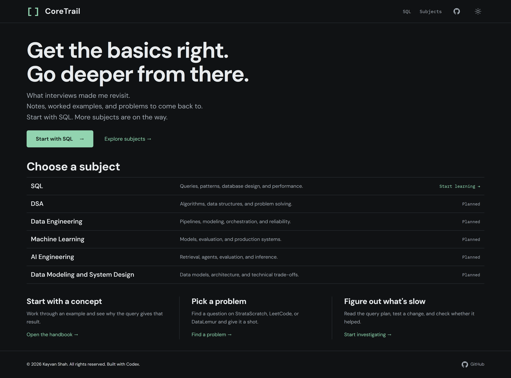
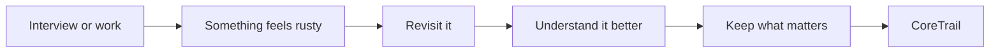
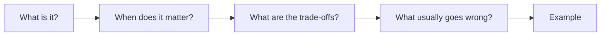
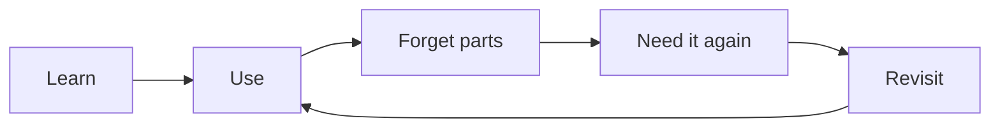

# CoreTrail

[](https://github.com/KayvanShah1/coretrail/actions/workflows/jekyll-gh-pages.yml)
[](https://kayvanshah1.github.io/coretrail/)

> What interviews made me revisit.

A Jekyll handbook for technical interview revision across data, AI, machine learning, software engineering, and related topics, with light and dark themes.

**[Open CoreTrail →](https://kayvanshah1.github.io/coretrail/)**

## Screenshots

### Desktop: Home page (dark mode)

[](app/assets/images/screenshots/desktop-home.png)

### Mobile: SQL lesson (light mode)

<a href="app/assets/images/screenshots/mobile-lesson.png"></a>

## Why I built it

A lot of my interview prep ended up inside ChatGPT.

One question turns into another and the same thread keeps running. Somewhere inside it is a good explanation I will probably need again. After enough chats, I was drowning in them.

I tried saving useful parts as Markdown too, but after a point that becomes another pile to organize and maintain. So I wanted one place where I could keep the parts worth coming back to.



## Philosophy

This is mostly for things I have already learned once. I should be able to open a topic and quickly answer:



If I need more depth, it should be there.
If I only need a reminder, I should not have to read a chapter.

## How I want to use it

Before an interview, I mostly use CoreTrail to skim things I already know but do not want to recall from scratch during the round.

After an interview, I usually come back to whatever made me hesitate, overthink, or realize I had a gap.

The same happens while building. If I run into something worth understanding properly, I would rather keep a useful note than have to rediscover it a few months later.

## What's here

SQL is the most developed section today, but CoreTrail is meant to cover the broader set of areas I work with and interview for:

- Data Engineering
- Data Modeling
- Databases
- System Design
- Machine Learning
- AI Engineering
- DSA

The structure will keep growing around the same idea: **fast recall first, depth when needed.**

### Included

- SQL currently has 83 topic pages across 15 chapters, plus chapter overviews.
- Expandable navigation, page outlines, and full-text search with Ctrl/Cmd K.
- Ranked search results show highlighted matching passages; the sun/moon toggle remembers your theme.
- Copyable SQL, expandable answers, problem filters, and an interactive window-frame explorer.
- PostgreSQL-first examples with selected BigQuery/MySQL differences.
- A CoreTrail landing page and subject switcher; DSA, Data Engineering, ML, AI Engineering, and Data Modeling/System Design have clearly marked planned pages.
- A filterable practice directory links 12 questions from StrataScratch, LeetCode, and DataLemur to related lessons.
- Native PostgreSQL labs use 120,000 orders and 90,000 events to check index access, date predicates, and partition pruning.

## A note on AI

A lot of the revisiting now happens through ChatGPT.

The problem is that the good parts get buried very quickly. Threads just keep growing, topics get mixed together, and after a while even saving useful chats as Markdown stops being worth the effort.

**CoreTrail** is partly my answer to that.

I still use AI heavily to explore and question things. I just do not want the useful parts to live only inside old chats. Codex also helps me build and maintain the site. The notes themselves still come from the things I actually had to revisit.

## Stack


Jekyll + Liquid, Markdown, custom CSS, vanilla JavaScript, PostgreSQL/PGlite, Playwright, and GitHub Actions.

## Repository structure

```text
app/
  templates/          # Liquid layouts and reusable includes
  subjects/           # SQL collection and planned subject pages
  _data/              # Subject, chapter, and practice metadata
  _sass/              # Stylesheet partials
  assets/             # JavaScript, CSS entry point, images, and SQL fixtures
  index.html          # Site home
  search.json         # Generated search index template
  pages/404.html      # Not-found page, published at /404.html

docs/                 # Content coverage and validation notes
scripts/              # Content and SQL checks
tests/                # Search regression tests
_config.yml           # Jekyll configuration; source is app/
```

SQL lessons and their landing page share `app/subjects/_sql/`. Source locations are independent of public URLs such as `/sql/windows/frames/`.

## Run locally

Requirements: Ruby with Bundler, and Node.js 22+ for checks.

```sh
bundle install
bundle exec jekyll serve --baseurl /coretrail
```

Open [localhost:4000 →](http://localhost:4000/coretrail/)

Run the check with:

```sh
npm ci
npm test
```

Performance-plan checks use PostgreSQL:

```sh
npm run test:plans
```

See [CONTRIBUTING.md](CONTRIBUTING.md) to add a lesson, [CONTENT_COVERAGE.md](docs/CONTENT_COVERAGE.md) for the content map, and [VALIDATION.md](docs/VALIDATION.md) for check scope.

## Deployment

GitHub Actions builds pull requests and pushes to main or site/**. Only successful main-branch builds deploy. Feature builds upload a site-preview artifact for review. Push and pull-request triggers skip changes limited to `docs/**`, `README.md`, `CONTRIBUTING.md`, and `LICENSE`. Lesson Markdown still triggers checks and builds; manual workflow runs remain available.

## Direction

I do not want CoreTrail to become a dump of everything I have ever learned.
I want it to stay useful when I need to get something back into my head quickly.



---

© 2026 Kayvan Shah. All rights reserved. Built with Codex.
