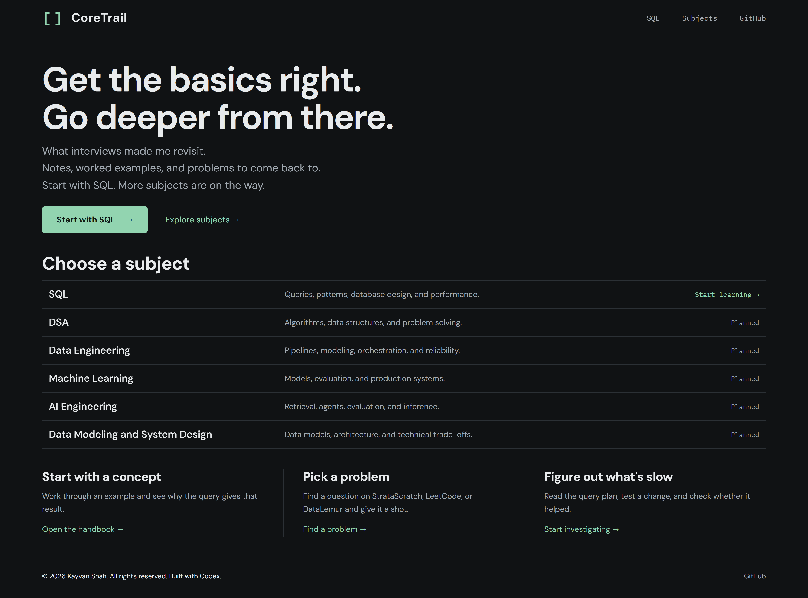
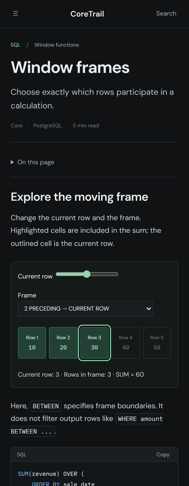

# CoreTrail

What interviews made me revisit.

A dark Jekyll handbook for technical interview revision across data, AI, machine learning, software engineering, and related topics.

**Read it:** https://kayvanshah1.github.io/coretrail/

## Screenshots

Click a screenshot to open it at full resolution.

### Desktop — home page

[](assets/images/screenshots/desktop-home.png)

### Mobile — SQL lesson

<a href="assets/images/screenshots/mobile-lesson.png"></a>

## Included

- SQL currently has 83 topic pages across 15 chapters, plus chapter overviews.
- Expandable navigation, page outlines, and full-text search with Ctrl/Cmd K.
- Copyable SQL, expandable answers, problem filters, and an interactive window-frame explorer.
- PostgreSQL-first examples with selected BigQuery/MySQL differences.
- A CoreTrail landing page and subject switcher; DSA, Data Engineering, ML, AI Engineering, and Data Modeling/System Design have clearly marked planned pages.
- A filterable practice directory links 12 questions from StrataScratch, LeetCode, and DataLemur to related lessons.
- Native PostgreSQL labs use 120,000 orders and 90,000 events to check index access, date predicates, and partition pruning.

## Run locally

Requirements: Ruby with Bundler, and Node.js 22+ for checks.

```sh
bundle install
bundle exec jekyll serve --baseurl /coretrail
```

Open http://localhost:4000/coretrail/.

```sh
npm ci
npm test
```

Selected SQL results are tested through PGlite, a PostgreSQL engine. It does not emulate concurrent database sessions.

See [CONTRIBUTING.md](CONTRIBUTING.md) to add a lesson, [CONTENT_COVERAGE.md](CONTENT_COVERAGE.md) for the content map, and [VALIDATION.md](VALIDATION.md) for check scope.

## Deployment

GitHub Actions builds pull requests and pushes to main or site/**. Only successful main-branch builds deploy. Feature builds upload a site-preview artifact for review.
